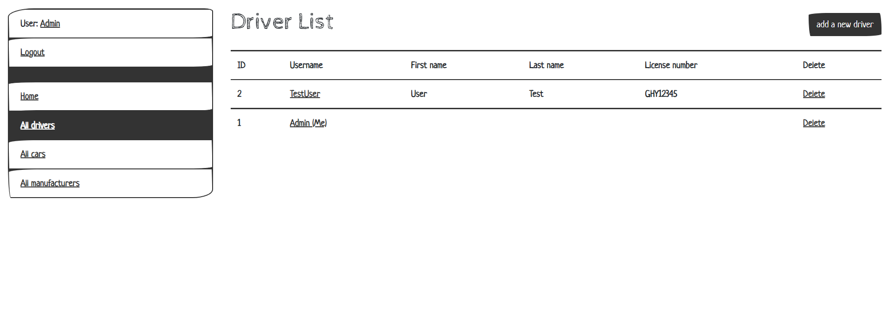

# Taxi service

Django project that demonstrates the work of a taxi service

# Check it out!

[Library project deployed on Heroku](https://taxi-service-v1.herokuapp.com/)

## Instalation

Python must be already installed

```shell
git clone https://github.com/YuriiKindrat/taxi_service
cd taxi_service
python3 -m venv venv
source venv/bin/activate
pip install -r requirments.txt
python manage.py runserver
```

## Features

* Authentication functionality for Driver -> User
* Managing cars, drivers and manufacturers directly from website
* Powerful admin panel for advanced managing

## Demo

